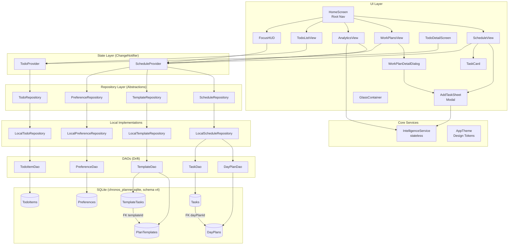
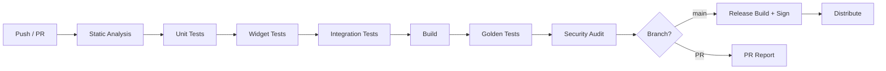

# Requirements Document — Chronos Planner Technical Specification Document

## Introduction

This Technical Specification Document (TSD) is the single source of truth for the **Chronosky** Flutter application (package: `chronosky`), a desktop-primary time-management and productivity tool. It covers all engineering, QA, and DevOps concerns from architecture through deployment. Every requirement is expressed in EARS format. Trade-offs are documented inline. Items requiring product-team resolution are flagged `[NEEDS CLARIFICATION]`.

**App Name:** Chronosky (marketed as Chronos Planner)
**Package:** `chronosky`
**Version at TSD baseline:** 1.0.0+1 (schema v4)
**Primary Platforms:** Windows, Linux, macOS
**Secondary Platforms:** Android, iOS
**Scaffolded (not production-ready):** Web

---

## Glossary

- **App** — The Chronosky Flutter application.
- **Scheduler** — The rolling 7-day schedule subsystem (`ScheduleView`, `ScheduleProvider`, `LocalScheduleRepository`).
- **TemplateEngine** — The plan-template subsystem (`WorkPlansView`, template DAOs, `TemplateRepository`).
- **IntelligenceService** — The stateless analytics and recommendation engine (`lib/core/services/intelligence_service.dart`).
- **TodoManager** — The standalone todo subsystem (`TodoListView`, `TodoProvider`, `TodoRepository`).
- **FocusMode** — The compact 320×200 always-on-top desktop window overlay.
- **Database** — The Drift/SQLite local database (`chronos_planner.sqlite`, schema v4).
- **Repository** — An abstract data-access interface (e.g., `ScheduleRepository`).
- **Provider** — A `ChangeNotifier` state-management object (e.g., `ScheduleProvider`).
- **DAO** — A Drift `DatabaseAccessor` (e.g., `TaskDao`).
- **DayPlan** — The aggregate domain model for one calendar day, containing a list of `Task` objects.
- **Task** — A time-blocked scheduled item with title, time range, type, priority, energy level, and cost.
- **TemplateTask** — A task stored inside a `PlanTemplate`; not directly scheduled.
- **TodoItem** — A standalone checklist item not tied to a calendar day.
- **WeekKey** — ISO-style string `YYYY-W##` grouping seven consecutive days.
- **UndoStack** — The in-memory list of reversible actions in `ScheduleProvider`.
- **GlassContainer** — The reusable glassmorphism widget using `BackdropFilter`.
- **DesignToken** — A named constant from `AppColors`, `AppSpacing`, `AppRadius`, `AppTextStyles`, or `AppAnimDurations`.
- **CI/CD** — Continuous Integration / Continuous Delivery pipeline.
- **WCAG** — Web Content Accessibility Guidelines 2.1.
- **ARB** — Application Resource Bundle (Flutter localization file format).
- **PBT** — Property-Based Testing.

---

## 1. Executive Summary

Chronosky is a glassmorphic, dark-themed Flutter productivity application built on a layered architecture: UI → Provider (ChangeNotifier) → Repository (abstract) → DAO (Drift) → SQLite. The desktop-primary design targets Windows, Linux, and macOS with a responsive fallback for Android and iOS.

**Current state (v1.0.0+1):** The core feature set is complete — rolling 7-day time-blocking, template system with recurring schedules, analytics dashboard, standalone todos, and a desktop Focus Mode. The codebase has zero automated test coverage, no CI/CD pipeline, no error boundaries, no structured logging, and several architectural debt items (mutable domain models, optimistic UI with silent failure, unbounded undo stack, N+1 query patterns, comma-separated `activeDays` encoding).

**This TSD defines the production-grade target state** across 16 engineering domains. It does not invent features beyond the confirmed roadmap. All requirements are grounded in the actual codebase as analysed.

**Roadmap summary (from `FEATURES.md`):**
- Q2 2026: Notifications, Pomodoro timer, Export/Import JSON
- Q3 2026: Calendar integration, Light mode, Keyboard shortcuts
- Q4 2026: Cloud sync (optional)

---

## 2. Technology Stack

| Layer | Technology | Version | Purpose |
|---|---|---|---|
| UI Framework | Flutter | ≥3.19.0 (Dart ≥3.0.0) | Cross-platform widget toolkit |
| State Management | provider (ChangeNotifier) | ^6.1.1 | Reactive UI state |
| Local Database | drift (SQLite ORM) | ^2.25.0 | Typed queries, migrations, streams |
| SQLite Native | sqlite3_flutter_libs | ^0.5.0 | Bundled SQLite for all platforms |
| File System | path_provider | ^2.1.0 | Platform documents directory |
| Path Utilities | path | ^1.9.0 | Cross-platform path joining |
| Window Control | window_manager | ^0.5.1 | Desktop window sizing/positioning |
| Typography | google_fonts (Inter) | ^8.0.1 | Inter font family |
| UUID Generation | uuid | ^4.3.3 | UUID v4 for all entity IDs |
| Date/Time | intl | ^0.20.2 | Formatting and locale support |
| Audio (future) | just_audio | ^0.9.40 | Pomodoro timer sounds (Q2 2026) |
| File I/O (future) | file_picker | ^8.0.0 | Export/Import JSON (Q2 2026) |
| Legacy Migration | shared_preferences | ^2.2.2 | One-time SP→Drift migration only |
| Linting | flutter_lints | ^6.0.0 | Base lint rules |
| Code Generation | drift_dev + build_runner | ^2.25.0 / ^2.4.0 | Drift schema generation |
| App Icons | flutter_launcher_icons | ^0.14.3 | Platform icon generation |
| Testing (target) | flutter_test + mockito | SDK / ^5.4.4 | Unit, widget, integration tests |
| Testing (PBT) | dart_test / fast_check port | — | Property-based tests [NEEDS CLARIFICATION: confirm PBT library choice] |
| Crash Reporting (target) | sentry_flutter | ^8.x | Structured crash reporting (Q2 2026) |
| Secure Storage (target) | flutter_secure_storage | ^9.x | Credential storage when auth added (Q4 2026) |

**Trade-off — Provider vs. Riverpod/Bloc:** Provider was chosen for simplicity and low boilerplate. The repository pattern ensures the state layer is testable independently. Migration to Riverpod is feasible without changing the data layer; defer until cloud sync (Q4 2026) introduces async complexity that warrants it.


---

## 3. Architecture Diagram



**Dependency rule:** UI depends on Providers; Providers depend on Repository interfaces; Local implementations depend on DAOs; DAOs depend on the Database. No layer may import from a layer above it.


---

## 4. Module Breakdown

### 4.1 Core Module (`lib/core/`)

| File | Responsibility | Consumers |
|---|---|---|
| `theme/app_theme.dart` | Design tokens: colors, typography, spacing, radii, shadows, animations, gradients | All UI files |
| `services/intelligence_service.dart` | Stateless analytics: efficiency score, energy peaks, time recommendations, task ROI | `AddTaskSheet`, `AnalyticsView` |

### 4.2 Data Module (`lib/data/`)

| File | Responsibility |
|---|---|
| `local/app_database.dart` | Drift singleton, schema v4, migration strategy v1→v4 |
| `local/tables.dart` | Drift table definitions (source of truth for schema) |
| `local/migration_helper.dart` | One-time SharedPreferences → Drift migration |
| `local/daos/task_dao.dart` | Task CRUD + reactive stream |
| `local/daos/day_plan_dao.dart` | DayPlan CRUD + week existence check |
| `local/daos/template_dao.dart` | Template + TemplateTask CRUD |
| `local/daos/preference_dao.dart` | Key-value upsert/read |
| `local/daos/todo_item_dao.dart` | TodoItem CRUD + reactive stream |
| `models/task_model.dart` | Task domain model + enums (TaskType, TaskPriority, TaskEnergyLevel) |
| `models/day_plan_model.dart` | DayPlan aggregate model |
| `models/plan_template_model.dart` | PlanTemplate model with recurring support |
| `repositories/schedule_repository.dart` | Abstract schedule interface |
| `repositories/template_repository.dart` | Abstract template interface |
| `repositories/todo_repository.dart` | Abstract todo interface |
| `repositories/preference_repository.dart` | Abstract preference interface |
| `repositories/local/local_schedule_repository.dart` | Drift-backed schedule implementation |
| `repositories/local/local_template_repository.dart` | Drift-backed template implementation |
| `repositories/local/local_todo_repository.dart` | Drift-backed todo implementation |
| `repositories/local/local_preference_repository.dart` | Drift-backed preference implementation |

### 4.3 State Module (`lib/providers/`)

| File | Responsibility |
|---|---|
| `schedule_provider.dart` | Week plan, templates, analytics, undo stack, sort order, recurring template logic |
| `todo_provider.dart` | Reactive todo list via database stream subscription |

### 4.4 UI Module (`lib/ui/`)

| File | Responsibility |
|---|---|
| `screens/home_screen.dart` | Root navigation (sidebar desktop / bottom nav mobile), Focus Mode toggle |
| `screens/schedule_view.dart` | 7-day rolling schedule, task CRUD, sort, undo |
| `screens/work_plans_view.dart` | Template library grid, create/apply templates |
| `screens/analytics_view.dart` | Efficiency score, energy peaks chart, category donut, daily breakdown |
| `screens/todo_list_view.dart` | Responsive grid of standalone todos |
| `screens/todo_detail_screen.dart` | Full-screen todo create/edit/delete |
| `widgets/task_card.dart` | Dismissible task tile with context menu |
| `widgets/add_task_sheet.dart` | Modal bottom sheet for task create/edit |
| `widgets/glass_container.dart` | Reusable glassmorphism container |
| `widgets/focus_hud.dart` | Compact Focus Mode overlay |
| `widgets/work_plan_detail_dialog.dart` | Template editor with recurring schedule |

### 4.5 Entry Point (`lib/main.dart`)

Initializes Flutter bindings, configures desktop window, initializes Database, runs one-time migration, constructs repositories, injects into `MultiProvider`, launches `MyApp`.


---

## 5. Data Model Specifications

### 5.1 Task

```json
{
  "$schema": "http://json-schema.org/draft-07/schema#",
  "title": "Task",
  "type": "object",
  "required": ["id", "title", "startTime", "endTime", "type", "priority", "energyLevel", "estimatedCost", "actualCost", "completed"],
  "properties": {
    "id":              { "type": "string", "format": "uuid", "description": "UUID v4" },
    "title":           { "type": "string", "minLength": 1, "maxLength": 200 },
    "description":     { "type": "string", "default": "" },
    "startTime":       { "type": "string", "pattern": "^([01]\\d|2[0-3]):[0-5]\\d$", "description": "HH:mm 24-hour" },
    "endTime":         { "type": "string", "pattern": "^([01]\\d|2[0-3]):[0-5]\\d$" },
    "type":            { "type": "string", "enum": ["work", "personal", "health", "leisure"] },
    "priority":        { "type": "string", "enum": ["low", "medium", "high"], "default": "medium" },
    "energyLevel":     { "type": "string", "enum": ["low", "medium", "high"], "default": "medium" },
    "estimatedCost":   { "type": "number", "minimum": 0.0, "default": 0.0 },
    "actualCost":      { "type": "number", "minimum": 0.0, "default": 0.0 },
    "completed":       { "type": "boolean", "default": false },
    "sourceTemplateId":{ "type": "string", "default": "", "description": "Empty string if not from template" }
  },
  "additionalProperties": false
}
```

**Constraint:** `startTime` and `endTime` MUST NOT be equal. Overnight ranges (e.g., `22:00`–`01:00`) are valid.

### 5.2 DayPlan

```json
{
  "$schema": "http://json-schema.org/draft-07/schema#",
  "title": "DayPlan",
  "type": "object",
  "required": ["id", "dateStr", "dayOfWeek", "date", "weekKey", "tasks"],
  "properties": {
    "id":        { "type": "string", "format": "uuid" },
    "dateStr":   { "type": "string", "description": "Display string e.g. 'Feb 10'" },
    "dayOfWeek": { "type": "string", "description": "Full weekday name e.g. 'Monday'" },
    "date":      { "type": "string", "format": "date-time", "description": "ISO 8601 UTC midnight" },
    "weekKey":   { "type": "string", "pattern": "^\\d{4}-W\\d{2}$", "description": "e.g. '2026-W07'" },
    "tasks":     { "type": "array", "items": { "$ref": "#/definitions/Task" } }
  }
}
```

### 5.3 PlanTemplate

```json
{
  "$schema": "http://json-schema.org/draft-07/schema#",
  "title": "PlanTemplate",
  "type": "object",
  "required": ["id", "name", "tasks", "activeDays"],
  "properties": {
    "id":          { "type": "string", "format": "uuid" },
    "name":        { "type": "string", "minLength": 1, "maxLength": 100 },
    "description": { "type": "string", "default": "" },
    "tasks":       { "type": "array", "items": { "$ref": "#/definitions/Task" } },
    "activeDays":  {
      "type": "array",
      "items": { "type": "integer", "minimum": 0, "maximum": 6 },
      "description": "0=Monday … 6=Sunday. Empty = not recurring."
    }
  }
}
```

### 5.4 TodoItem

```json
{
  "$schema": "http://json-schema.org/draft-07/schema#",
  "title": "TodoItem",
  "type": "object",
  "required": ["id", "title", "completed", "createdAt"],
  "properties": {
    "id":          { "type": "string", "format": "uuid" },
    "title":       { "type": "string", "minLength": 1, "maxLength": 200 },
    "description": { "type": "string", "default": "" },
    "completed":   { "type": "boolean", "default": false },
    "createdAt":   { "type": "string", "format": "date-time" }
  }
}
```


---

## 6. API Contract

> **Note:** Chronosky is currently a fully offline application. There is no remote API. This section documents the internal repository interface contracts (analogous to an API contract) and the planned cloud-sync API shape for Q4 2026.

### 6.1 Internal Repository Contracts

#### ScheduleRepository

```
getUpcomingDays(count: int) → Future<List<DayPlan>>
  Precondition:  count ∈ [1, 365]
  Postcondition: Returns exactly `count` DayPlan objects starting from today (UTC midnight).
                 Missing days are auto-created with empty task lists.

addTaskToDate(date: DateTime, task: Task) → Future<void>
  Precondition:  task.title.length ∈ [1, 200]; task.startTime ≠ task.endTime
  Postcondition: Task persisted; DayPlan auto-created if absent.

saveDayPlan(dayPlan: DayPlan) → Future<void>
  Postcondition: All existing tasks for dayPlan.id deleted; dayPlan.tasks batch-inserted.
  [RISK: Not wrapped in a transaction — partial failure leaves inconsistent state]

updateTask(dayPlanId: String, taskId: String, task: Task) → Future<void>
deleteTask(dayPlanId: String, taskId: String) → Future<void>
clearDay(dayPlanId: String) → Future<void>
```

#### TemplateRepository

```
getAllTemplates() → Future<List<PlanTemplate>>
  [RISK: N+1 query — fetches tasks per template in a loop]

addTemplate(template: PlanTemplate) → Future<void>
updateTemplateActiveDays(id: String, days: List<int>) → Future<void>
  Encoding: days serialized as comma-separated string in DB (e.g., "0,2,4")
  [RISK: No validation of day values at encoding boundary]

deleteTemplate(id: String) → Future<void>
  Postcondition: Template metadata AND all TemplateTasks deleted (manual cascade).
```

#### TodoRepository

```
watchTodos() → Stream<List<TodoItem>>
  Order: descending createdAt (newest first)

addTodo(title: String, description: String) → Future<TodoItem>
updateTodo(todo: TodoItem) → Future<void>
deleteTodo(id: String) → Future<void>
```

#### PreferenceRepository

```
get(key: String) → Future<String?>
set(key: String, value: String) → Future<void>   // upsert semantics
remove(key: String) → Future<void>
```

### 6.2 Planned Cloud Sync API (Q4 2026) — [NEEDS CLARIFICATION]

> The following is a placeholder shape. Product team must confirm: REST vs. GraphQL, auth mechanism (OAuth2 / API key), conflict resolution strategy (last-write-wins vs. CRDT), and hosting provider.

```yaml
# OpenAPI 3.1 placeholder
openapi: "3.1.0"
info:
  title: Chronosky Sync API
  version: "1.0.0"
paths:
  /sync/dayplans:
    post:
      summary: Upload local day plans delta
      requestBody:
        content:
          application/json:
            schema:
              type: object
              properties:
                deviceId: { type: string }
                lastSyncAt: { type: string, format: date-time }
                dayPlans: { type: array, items: { $ref: '#/components/schemas/DayPlan' } }
  /sync/pull:
    get:
      summary: Pull server changes since lastSyncAt
      parameters:
        - name: since
          in: query
          schema: { type: string, format: date-time }
```


---

## 7. Database Schema

### 7.1 Entity Definitions (Schema v4)

#### Table: `tasks`
| Column | SQLite Type | Constraints | Notes |
|---|---|---|---|
| `id` | TEXT | PRIMARY KEY | UUID v4 |
| `title` | TEXT | NOT NULL | 1–200 chars enforced at app layer |
| `description` | TEXT | NOT NULL DEFAULT '' | |
| `start_time` | TEXT | NOT NULL | `HH:mm` format |
| `end_time` | TEXT | NOT NULL | `HH:mm` format |
| `type` | TEXT | NOT NULL | `work\|personal\|health\|leisure` |
| `priority` | TEXT | NOT NULL DEFAULT 'medium' | `low\|medium\|high` |
| `energy_level` | TEXT | NOT NULL DEFAULT 'medium' | Added v4 |
| `estimated_cost` | REAL | NOT NULL DEFAULT 0.0 | Added v4 |
| `actual_cost` | REAL | NOT NULL DEFAULT 0.0 | Added v4 |
| `completed` | INTEGER | NOT NULL DEFAULT 0 | Boolean (0/1) |
| `day_plan_id` | TEXT | NOT NULL | FK → `day_plans.id` (no CASCADE) |
| `source_template_id` | TEXT | NOT NULL DEFAULT '' | Added v2 |

#### Table: `day_plans`
| Column | SQLite Type | Constraints | Notes |
|---|---|---|---|
| `id` | TEXT | PRIMARY KEY | UUID v4 |
| `date_str` | TEXT | NOT NULL | Display string e.g. `Feb 10` |
| `day_of_week` | TEXT | NOT NULL | Full name e.g. `Monday` |
| `date` | INTEGER | NOT NULL | Unix timestamp (Drift DateTime) |
| `week_key` | TEXT | NOT NULL | `YYYY-W##` |

#### Table: `plan_templates`
| Column | SQLite Type | Constraints | Notes |
|---|---|---|---|
| `id` | TEXT | PRIMARY KEY | UUID v4 |
| `name` | TEXT | NOT NULL | 1–100 chars |
| `description` | TEXT | NOT NULL DEFAULT '' | |
| `active_days` | TEXT | NOT NULL DEFAULT '' | Comma-separated ints e.g. `0,2,4` |

#### Table: `template_tasks`
| Column | SQLite Type | Constraints | Notes |
|---|---|---|---|
| `id` | TEXT | PRIMARY KEY | UUID v4 |
| `template_id` | TEXT | NOT NULL | FK → `plan_templates.id` (no CASCADE) |
| `title` | TEXT | NOT NULL | |
| `description` | TEXT | NOT NULL DEFAULT '' | |
| `start_time` | TEXT | NOT NULL | |
| `end_time` | TEXT | NOT NULL | |
| `type` | TEXT | NOT NULL | |
| `priority` | TEXT | NOT NULL DEFAULT 'medium' | |
| `energy_level` | TEXT | NOT NULL DEFAULT 'medium' | Added v4 |
| `estimated_cost` | REAL | NOT NULL DEFAULT 0.0 | Added v4 |

#### Table: `preferences`
| Column | SQLite Type | Constraints |
|---|---|---|
| `key` | TEXT | PRIMARY KEY |
| `value` | TEXT | NOT NULL |

#### Table: `todo_items`
| Column | SQLite Type | Constraints | Notes |
|---|---|---|---|
| `id` | TEXT | PRIMARY KEY | UUID v4 |
| `title` | TEXT | NOT NULL | 1–200 chars |
| `description` | TEXT | NOT NULL DEFAULT '' | |
| `completed` | INTEGER | NOT NULL DEFAULT 0 | Boolean |
| `created_at` | INTEGER | NOT NULL | Unix timestamp |

### 7.2 Indexes (Target State)

```sql
-- Accelerate day-scoped task queries (most frequent read path)
CREATE INDEX IF NOT EXISTS idx_tasks_day_plan_id ON tasks(day_plan_id);

-- Accelerate week-scoped day plan queries
CREATE INDEX IF NOT EXISTS idx_day_plans_week_key ON day_plans(week_key);

-- Accelerate template task lookups
CREATE INDEX IF NOT EXISTS idx_template_tasks_template_id ON template_tasks(template_id);

-- Accelerate todo ordering
CREATE INDEX IF NOT EXISTS idx_todo_items_created_at ON todo_items(created_at DESC);
```

> **Current state:** No explicit indexes defined. Drift creates a B-tree index on each PRIMARY KEY automatically. The above indexes must be added in schema v5.

### 7.3 Relations

```
day_plans (1) ──────────────── (N) tasks
  day_plans.id = tasks.day_plan_id
  [RISK: No FOREIGN KEY PRAGMA or ON DELETE CASCADE — orphan tasks possible]

plan_templates (1) ──────────── (N) template_tasks
  plan_templates.id = template_tasks.template_id
  [RISK: Same — manual cascade in TemplateDao.deleteTemplate()]
```

### 7.4 Migration Plan

| Version | Changes | Migration SQL |
|---|---|---|
| v1 → v2 | Add `source_template_id` to tasks; add `active_days` to plan_templates | `ALTER TABLE tasks ADD COLUMN source_template_id TEXT NOT NULL DEFAULT ''` |
| v2 → v3 | Create `todo_items` table | `CREATE TABLE todo_items (...)` |
| v3 → v4 | Add `energy_level`, `estimated_cost`, `actual_cost` to tasks; add `energy_level`, `estimated_cost` to template_tasks | Multiple `ALTER TABLE ... ADD COLUMN` |
| v4 → v5 (target) | Add indexes; enable FK pragma; migrate `active_days` to junction table `template_active_days(template_id, day_of_week)` | See §7.5 |

### 7.5 Schema v5 Migration Detail (Target)

```sql
-- Step 1: Enable foreign keys (must be per-connection)
PRAGMA foreign_keys = ON;

-- Step 2: Create indexes (see §7.2)

-- Step 3: Migrate active_days to junction table
CREATE TABLE template_active_days (
  template_id TEXT NOT NULL REFERENCES plan_templates(id) ON DELETE CASCADE,
  day_of_week INTEGER NOT NULL CHECK(day_of_week BETWEEN 0 AND 6),
  PRIMARY KEY (template_id, day_of_week)
);

-- Populate from existing comma-separated strings (handled in Dart migration helper)
-- Step 4: Drop active_days column from plan_templates (SQLite requires table rebuild)
```

> **Trade-off:** The junction table migration is a breaking schema change requiring a table rebuild (SQLite does not support DROP COLUMN in older versions). The Dart migration helper must read all templates, parse `active_days`, insert into the junction table, then recreate `plan_templates` without the column. This is safe but complex; schedule for v5 with a dedicated migration test.


---

## 8. UI Component Library

### 8.1 Design Tokens

| Token Class | Token | Value | Usage |
|---|---|---|---|
| `AppColors` | `background` | `#0F172A` | Scaffold background |
| `AppColors` | `surface` | `#1E293B` | Card/dialog backgrounds |
| `AppColors` | `surfaceLight` | `#334155` | Hover/active states |
| `AppColors` | `neonBlue` | `#4F46E5` | Primary accent, CTAs |
| `AppColors` | `neonPurple` | `#A855F7` | Secondary accent |
| `AppColors` | `neonCyan` | `#06B6D4` | Peak hour highlight |
| `AppColors` | `textPrimary` | `#F8FAFC` | Body text |
| `AppColors` | `textSecondary` | `#94A3B8` | Labels, subtitles |
| `AppColors` | `work` | `#3B82F6` | Work task type |
| `AppColors` | `personal` | `#A855F7` | Personal task type |
| `AppColors` | `health` | `#10B981` | Health task type |
| `AppColors` | `leisure` | `#F59E0B` | Leisure task type |
| `AppSpacing` | `xs/sm/md/lg/xl/xxl` | `4/8/16/24/32/48 px` | All padding/margin |
| `AppRadius` | `sm/md/lg/xl/xxl/pill` | `8/12/16/20/24/999 px` | Border radii |
| `AppAnimDurations` | `fast/normal/slow/stagger` | `150/300/500/50 ms` | All animations |

### 8.2 Component Catalog

#### GlassContainer

| Prop | Type | Required | Default | Constraint |
|---|---|---|---|---|
| `child` | `Widget` | Yes | — | Any widget |
| `padding` | `EdgeInsetsGeometry?` | No | null | — |
| `onTap` | `VoidCallback?` | No | null | Enables scale animation |
| `color` | `Color?` | No | `AppColors.glassFill` | — |
| `borderGradientColors` | `List<Color>?` | No | null | Exactly 2 colors if provided |
| `blurSigma` | `double` | No | `10.0` | Range [0, 40]; >20 degrades performance on low-end |

**Behavior:** Applies `BackdropFilter` with `ImageFilter.blur(sigmaX, sigmaY)`. On tap: scale to 0.97 over 150ms, release to 1.0. Gradient border rendered via `CustomPaint` (`_GradientBorderPainter`).

**Performance note:** `BackdropFilter` triggers a compositing layer. Wrap in `RepaintBoundary` at call sites where the parent repaints frequently.

#### TaskCard

| Prop | Type | Required | Constraint |
|---|---|---|---|
| `task` | `Task` | Yes | — |
| `onToggle` | `VoidCallback` | Yes | — |
| `onDelete` | `VoidCallback` | Yes | — |
| `onEdit` | `VoidCallback?` | No | — |
| `onDuplicate` | `VoidCallback?` | No | — |

**Behavior:** `Dismissible` (endToStart) triggers `onDelete`. Long-press shows `PopupMenu` at touch position with Edit/Duplicate/Delete. Completed state: opacity 0.5, strikethrough title. Uses `AnimatedContainer` + `AnimatedOpacity` (300ms, `easeOutCubic`). Key: `task.id` (stable UUID).

#### AddTaskSheet

| Prop | Type | Required | Notes |
|---|---|---|---|
| `onAdd` | `Function(Task, DateTime)` | Yes | Called on create |
| `onUpdate` | `Function(Task)?` | No | Called on edit |
| `editingTask` | `Task?` | No | Null = create mode |
| `defaultDate` | `DateTime?` | No | Pre-selects date |

**Validation:** Title non-empty; `startTime ≠ endTime`; cost parses to non-negative double. Smart time suggestion via `IntelligenceService.recommendTime()`.

#### FocusHUD

| Prop | Type | Required |
|---|---|---|
| `onExit` | `VoidCallback` | Yes |

**Behavior:** Reads `ScheduleProvider.selectedDay.tasks`, finds first uncompleted task. Shows title + time range + Complete button. Empty state: "All caught up!" message. Designed for 320×200 window.

#### WorkPlanDetailDialog

| Prop | Type | Required |
|---|---|---|
| `template` | `PlanTemplate` | Yes |

**Behavior:** Full template editor. Day selector (0=Mon, 6=Sun). "This Week" applies to selected days once. "Every Week" sets `activeDays` and triggers `setTemplateRecurring`. "Stop Recurring" clears `activeDays`. Delete shows confirmation dialog.

### 8.3 Breakpoints

| Breakpoint | Width | Layout |
|---|---|---|
| Desktop | > 800px | 250px sidebar + content area |
| Mobile | ≤ 800px | Bottom navigation bar |
| Template grid | > 600px | 3 columns |
| Template grid | ≤ 600px | 1 column |
| Todo grid | Any | `maxCrossAxisExtent: 300px` (responsive wrap) |

### 8.4 Animation Inventory

| Animation | Duration | Curve | Trigger |
|---|---|---|---|
| Screen transition (fade+slide) | 300ms | `easeOutCubic` | Tab change |
| Task card completion | 300ms | `easeOutCubic` | Toggle complete |
| GlassContainer tap scale | 150ms | `easeOutCubic` | Tap down/up |
| Analytics bar chart | 1000ms | `easeOut` | View mount |
| Analytics progress bars | 600–800ms staggered | `easeOut` | View mount |
| Analytics fade-in | 500ms | `easeOut` | View mount |
| Sidebar item hover | 150ms | linear | Hover enter/exit |
| Template card stagger | 50ms per item | `easeOut` | List build |


---

## 9. Testing Blueprint

### 9.1 Coverage Targets

| Layer | Target Line Coverage | Test Type |
|---|---|---|
| Domain models (`task_model`, `day_plan_model`, `plan_template_model`) | 100% | Unit |
| `IntelligenceService` | 100% | Unit + PBT |
| Repository interfaces (mock implementations) | 90% | Unit |
| `ScheduleProvider` | 85% | Unit (mock repos) |
| `TodoProvider` | 85% | Unit (mock repos) |
| DAOs (in-memory Drift) | 80% | Integration |
| UI Widgets (golden + widget tests) | 70% | Widget + Golden |
| End-to-end flows | 3 critical paths | Integration |

### 9.2 Unit Tests

#### Domain Models
- `Task.copyWith()` preserves all unchanged fields (property: identity under no-op copy)
- `Task.toJson()` / `Task.fromJson()` round-trip: `fromJson(toJson(task)) == task` (PBT)
- `PlanTemplate.isRecurring` returns `true` iff `activeDays.isNotEmpty`
- `DayPlan` serialization round-trip (PBT)

#### IntelligenceService
- `calculateEfficiency([])` returns `0.0`
- `calculateEfficiency(allCompleted)` returns `100.0`
- `calculateEfficiency(halfCompleted)` returns `50.0`
- `getEnergyPeaks([])` returns empty map
- `getEnergyPeaks(tasks)` — all keys in range [0, 23] (property)
- `getEnergyPeaks(tasks)` — all values in range [0.0, 1.0] (property)
- `recommendTime(high, peaks)` returns hour with max score
- `recommendTime(low, peaks)` returns hour with min score
- `recommendTime(any, {})` returns `"09:00"`
- `calculateTaskROI(task with actualCost=0)` returns `1.0`
- `calculateTaskROI` — high priority returns higher ROI than low priority at same cost (metamorphic)

#### ScheduleProvider
- `addTask` adds task to correct day in `weekPlan`
- `deleteTask` removes task and pushes to undo stack
- `undo` after `deleteTask` restores task
- `undo` after `clearDay` restores all tasks
- `toggleSortOrder` alternates between `asc` and `desc`
- `getSortedTasks(asc)` returns tasks in ascending `startTime` order (property)
- `getSortedTasks(desc)` returns tasks in descending `startTime` order (property)
- `validateTimeRange("09:00", "09:00")` returns non-null error
- `validateTimeRange("22:00", "01:00")` returns null (overnight valid)
- `setTemplateRecurring` does not apply template to day that already has `sourceTemplateId`

#### TodoProvider
- `addTodo` triggers `notifyListeners` via stream
- `toggleTodo` inverts `completed` field
- `dispose` cancels stream subscription (no leak)

### 9.3 Integration Tests (DAO Layer — In-Memory Drift)

Use `NativeDatabase.memory()` for all DAO tests.

- `TaskDao.insertTask` then `getTasksForDay` returns inserted task
- `TaskDao.deleteTaskById` removes task; subsequent query returns empty
- `TaskDao.watchTasksForDay` emits updated list after insert
- `DayPlanDao.weekExists` returns false for unknown weekKey
- `DayPlanDao.insertDayPlans` then `getDayPlansForWeek` returns all 7 plans
- `TemplateDao.deleteTemplate` removes template AND all associated TemplateTasks
- `TodoItemDao.watchAllTodos` emits newest-first order (property: `createdAt` descending)
- `PreferenceDao.setValue` upserts (second call with same key overwrites)

### 9.4 Widget Tests

- `GlassContainer` renders child widget
- `GlassContainer` with `onTap` triggers callback on tap
- `TaskCard` displays title, startTime, endTime
- `TaskCard` shows strikethrough and 0.5 opacity when `task.completed = true`
- `TaskCard` calls `onDelete` on swipe-to-dismiss
- `AddTaskSheet` disables submit when title is empty
- `AddTaskSheet` shows time error when `startTime == endTime`
- `FocusHUD` shows "All caught up!" when no uncompleted tasks
- `FocusHUD` shows first uncompleted task title

### 9.5 Golden Tests

- `TaskCard` (active state) — desktop 1200px
- `TaskCard` (completed state) — desktop 1200px
- `GlassContainer` (with gradient border) — desktop 1200px
- `AnalyticsView` (populated data) — desktop 1200px
- `HomeScreen` (desktop sidebar layout) — 1200×800
- `HomeScreen` (mobile bottom nav layout) — 375×812

### 9.6 End-to-End Integration Tests

1. **Create → Complete → Undo flow:** Add task to today → toggle complete → delete → undo → verify task restored
2. **Template apply flow:** Create template with 2 tasks → apply to current week Monday → verify tasks appear in Monday DayPlan
3. **Todo CRUD flow:** Create todo → edit title → toggle complete → delete → verify list empty

### 9.7 Property-Based Tests (PBT)

| Property | Generator | Library |
|---|---|---|
| `Task` JSON round-trip | Random valid Task | dart_test / hypothesis port |
| `DayPlan` JSON round-trip | Random DayPlan with 0–10 tasks | — |
| `getSortedTasks(asc)` is sorted | Random task list | — |
| `getEnergyPeaks` values ∈ [0,1] | Random task history | — |
| `validateTimeRange` never throws | Random string pairs | — |
| `_calculateWeekKey` idempotent | Random dates | — |

> **Decision:** PBT is appropriate for pure functions (serialization, sorting, analytics). It is NOT appropriate for DAO tests (external SQLite) or window manager calls (platform channel). Use integration tests with 2–3 representative examples for those.

### 9.8 Mocking Strategy

```dart
// Use mockito @GenerateMocks for all repository interfaces
@GenerateMocks([ScheduleRepository, TemplateRepository, PreferenceRepository, TodoRepository])

// Use in-memory Drift database for DAO tests
final db = AppDatabase(NativeDatabase.memory());

// Never mock DAOs directly — test through repository implementations
```


---

## 10. Security Checklist

| # | Control | Status | Requirement |
|---|---|---|---|
| S-01 | No secrets in source code | ✅ (no auth yet) | THE App SHALL store no API keys, tokens, or credentials in source files or assets |
| S-02 | Secure storage for future credentials | ⬜ Q4 2026 | WHERE cloud sync is enabled, THE App SHALL store auth tokens in `flutter_secure_storage` (Keychain/Keystore), never in SharedPreferences or Drift |
| S-03 | Input validation — task title | ⚠️ Partial | THE App SHALL reject task titles with length < 1 or > 200 characters before persisting to the Database |
| S-04 | Input validation — time format | ⚠️ Partial | THE App SHALL validate that `startTime` and `endTime` match `HH:mm` before persisting; IF validation fails, THEN THE App SHALL display an inline error and block submission |
| S-05 | Input validation — cost field | ⚠️ Partial | THE App SHALL parse `estimatedCost` as a non-negative double; IF parsing fails, THEN THE App SHALL default to `0.0` and log a warning |
| S-06 | SQL injection prevention | ✅ | THE Database SHALL use Drift parameterized queries exclusively; raw SQL strings with user input SHALL NOT be used |
| S-07 | No `print()` in production | ❌ Present | THE App SHALL replace all `print()` calls with a structured logger before release builds; `avoid_print` lint rule SHALL be enabled |
| S-08 | Network security (future) | ⬜ Q4 2026 | WHERE network requests are made, THE App SHALL enforce HTTPS with certificate pinning; plain HTTP SHALL NOT be permitted |
| S-09 | File export security | ⬜ Q2 2026 | WHEN exporting JSON, THE App SHALL write to a user-selected path via `file_picker`; THE App SHALL NOT write to system directories without explicit user consent |
| S-10 | Database file permissions | ✅ | THE Database file (`chronos_planner.sqlite`) SHALL reside in the platform application documents directory, which is sandboxed on all supported platforms |
| S-11 | Dependency vulnerability scanning | ❌ Missing | THE CI/CD pipeline SHALL run `flutter pub audit` on every pull request and block merge on HIGH or CRITICAL vulnerabilities |
| S-12 | No `debugShowCheckedModeBanner` in release | ✅ | THE App SHALL set `debugShowCheckedModeBanner: false` in `MaterialApp` (already done) |
| S-13 | Error messages — no stack traces to UI | ❌ Missing | IF an unhandled exception occurs, THEN THE App SHALL display a generic user-facing error message; stack traces SHALL be sent to the crash reporter only, never rendered in the UI |
| S-14 | `FlutterError.onError` configured | ❌ Missing | THE App SHALL configure `FlutterError.onError` and `PlatformDispatcher.instance.onError` in `main()` to capture all unhandled errors before release |


---

## 11. Performance Budget

### 11.1 Startup

| Metric | Target | Measurement Method |
|---|---|---|
| Cold start to first frame (desktop) | < 2 000ms | `flutter run --profile` + DevTools Timeline |
| Cold start to first frame (mobile) | < 3 000ms | Same |
| Database initialization | < 500ms | Stopwatch in `main()` |
| `_loadData()` (7-day plan load) | < 300ms | Stopwatch in `ScheduleProvider` |

### 11.2 Runtime

| Metric | Target | Notes |
|---|---|---|
| Frame render time (steady state) | < 16ms (60fps) | No jank on task list scroll |
| Frame render time (animations) | < 8ms (120fps capable) | Desktop monitors |
| `BackdropFilter` blur (GlassContainer) | ≤ 10ms per frame | Wrap in `RepaintBoundary` |
| `AnalyticsView` chart animation | No dropped frames | Use `AnimationController` with `Tween` |
| `getSortedTasks` (100 tasks) | < 1ms | Pure in-memory sort |
| `getEnergyPeaks` (500 tasks) | < 5ms | Pure computation; move to isolate if > 10ms |

### 11.3 Memory

| Metric | Target |
|---|---|
| Baseline heap (desktop, idle) | < 80MB |
| Peak heap during analytics render | < 120MB |
| No retained `BuildContext` after widget dispose | Verified by leak detector |
| `TodoProvider` stream subscription cancelled on dispose | Verified by test |

### 11.4 Build Size

| Platform | Target APK/IPA/EXE size |
|---|---|
| Android (arm64) | < 25MB |
| iOS | < 30MB |
| Windows (MSIX) | < 50MB |
| macOS (DMG) | < 50MB |

### 11.5 Optimization Requirements

- THE App SHALL use `const` constructors on all stateless widgets that have no runtime-variable props.
- THE App SHALL wrap `GlassContainer` usages inside frequently-repainting parents with `RepaintBoundary`.
- THE App SHALL NOT perform synchronous database reads on the UI isolate; all Drift queries SHALL use `async/await` or streams.
- WHEN `getEnergyPeaks` processes more than 200 tasks, THE IntelligenceService SHALL execute the computation in a `compute()` isolate.
- THE App SHALL use `ListView.builder` (not `ListView(children: [...])`) for all lists with potentially more than 20 items.
- THE App SHALL NOT call `notifyListeners()` more than once per user action in a single synchronous call stack.
- THE App SHALL enable tree-shaking and obfuscation in release builds (`flutter build --obfuscate --split-debug-info`).

### 11.6 BackdropFilter Strategy

**Trade-off:** `BackdropFilter` produces the glassmorphism aesthetic but is expensive. On low-end Android devices (< 4GB RAM), it can cause frame drops.

**Decision:** Keep `BackdropFilter` for desktop (primary platform). On mobile, provide a fallback: if `MediaQuery.of(context).platformBrightness` detects a low-performance device [NEEDS CLARIFICATION: define detection heuristic — device RAM API not available in Flutter; consider `kIsWeb` + platform check], substitute `BackdropFilter` with a solid `AppColors.surface` background.


---

## 12. Deployment Pipeline

### 12.1 Pipeline Stages



### 12.2 Stage Definitions

#### Stage 1: Static Analysis
```bash
flutter analyze --fatal-infos
dart format --set-exit-if-changed .
```
- Fails on any lint warning or formatting deviation.
- `analysis_options.yaml` MUST enable `avoid_print`, `prefer_const_constructors`, `prefer_const_literals_to_create_immutables`, `use_key_in_widget_constructors`.

#### Stage 2: Unit Tests
```bash
flutter test test/unit/ --coverage
```
- Fails if line coverage drops below targets in §9.1.
- Coverage report uploaded as artifact.

#### Stage 3: Widget Tests
```bash
flutter test test/widget/
```

#### Stage 4: Integration Tests
```bash
flutter test integration_test/ --device-id=<emulator>
```
- Runs the 3 critical E2E flows defined in §9.6.

#### Stage 5: Build
```bash
# Desktop
flutter build windows --release
flutter build linux --release
flutter build macos --release
# Mobile
flutter build apk --release --split-per-abi
flutter build ios --release --no-codesign
```
- Fails on any compilation error.

#### Stage 6: Golden Tests
```bash
flutter test test/golden/ --update-goldens=false
```
- Fails if any golden pixel diff exceeds 0.1% threshold.

#### Stage 7: Security Audit
```bash
flutter pub audit
```
- Fails on HIGH or CRITICAL vulnerabilities.

#### Stage 8: Release Build + Sign (main branch only)
- Windows: MSIX signing with code-signing certificate [NEEDS CLARIFICATION: certificate provider and storage (GitHub Secrets / Azure Key Vault)]
- macOS: Notarization via Apple Developer account [NEEDS CLARIFICATION: Apple ID and app-specific password storage]
- Android: APK/AAB signing with keystore [NEEDS CLARIFICATION: keystore storage strategy]
- iOS: IPA signing [NEEDS CLARIFICATION: provisioning profile management]

#### Stage 9: Distribute
- Desktop: GitHub Releases (MSIX, DMG, AppImage)
- Android: Google Play Internal Track
- iOS: TestFlight
- [NEEDS CLARIFICATION: distribution channels confirmed by product team?]

### 12.3 Quality Gates

| Gate | Threshold | Blocks |
|---|---|---|
| `flutter analyze` warnings | 0 | All stages |
| Unit test coverage | ≥ targets in §9.1 | Stage 3 |
| Golden pixel diff | < 0.1% | Stage 6 |
| `pub audit` HIGH/CRITICAL | 0 | Stage 7 |
| Build success | All platforms | Stage 5 |

### 12.4 CI/CD Platform

[NEEDS CLARIFICATION: GitHub Actions vs. Codemagic vs. Bitrise. Recommend GitHub Actions for open-source; Codemagic for iOS/macOS signing automation.]

**Recommended GitHub Actions matrix:**
```yaml
strategy:
  matrix:
    os: [ubuntu-latest, windows-latest, macos-latest]
    flutter-version: ['3.19.x']
```


---

## 13. Risk Register

| ID | Risk | Severity | Likelihood | Impact | Mitigation |
|---|---|---|---|---|---|
| R-01 | Optimistic UI + silent DB failure leaves UI and DB out of sync | High | Medium | Data loss / corruption | Wrap all write operations in try/catch; on failure, revert in-memory state and show error snackbar; add `saveDayPlan` transaction wrapper |
| R-02 | Unbounded undo stack causes memory growth on long sessions | Medium | Low | OOM on low-RAM devices | Cap `_undoStack` at 50 entries; evict oldest on overflow |
| R-03 | `activeDays` comma-string encoding is fragile and untestable | Medium | High | Recurring templates silently broken on bad data | Migrate to junction table (schema v5, §7.5); add round-trip PBT for encoding/decoding |
| R-04 | No foreign key CASCADE — orphan tasks after DayPlan delete | Medium | Medium | DB bloat, stale data | Enable `PRAGMA foreign_keys = ON` in schema v5; add ON DELETE CASCADE to `tasks.day_plan_id` and `template_tasks.template_id` |
| R-05 | N+1 query in `getAllTemplates` degrades with many templates | Medium | Medium | Slow template load (>50 templates) | Replace with a single JOIN query in `TemplateDao`; add index on `template_tasks.template_id` |
| R-06 | No `==` / `hashCode` on domain models — equality checks fail | High | High | Incorrect state comparisons, duplicate list items | Implement `Equatable` or manual `==`/`hashCode` on `Task`, `DayPlan`, `PlanTemplate`, `TodoItem` |
| R-07 | Mutable `tasks` list on `DayPlan` — callers can mutate shared state | High | Medium | Race conditions, unexpected UI state | Make `tasks` a `List<Task>` getter returning `UnmodifiableListView`; all mutations go through Provider |
| R-08 | `print()` statements in production paths leak debug info | Low | High | Log pollution, potential info disclosure | Enable `avoid_print` lint; replace with structured logger before v1.1 |
| R-09 | No `FlutterError.onError` — unhandled exceptions silently swallowed | High | High | Crashes not reported; users see blank screens | Configure error boundaries in `main()` before v1.1 |
| R-10 | No test coverage — regressions undetected | High | High | Feature breakage on refactor | Implement test pyramid (§9) before any Q2 2026 feature work |
| R-11 | `BackdropFilter` performance on low-end Android | Medium | Medium | Frame drops, poor UX | Add `RepaintBoundary`; provide solid-color fallback on mobile (§11.6) |
| R-12 | `saveDayPlan` delete+re-insert not transactional | High | Low | Partial write on crash leaves day with no tasks | Wrap in Drift `transaction()` block |
| R-13 | `_calculateWeekKey` diverges from ISO 8601 standard | Medium | Low | Tasks assigned to wrong week | Add unit test comparing output to `intl` package's `DateFormat('yyyy-Www')` |
| R-14 | No CI/CD — manual releases error-prone | High | High | Unsigned builds, missed tests, version drift | Implement pipeline (§12) before v1.1 release |
| R-15 | `just_audio` and `file_picker` included but unused (dead weight) | Low | High | Unnecessary APK size increase | Remove from `pubspec.yaml` until Q2 2026 features are implemented |
| R-16 | `shared_preferences` retained after migration | Low | Medium | Unnecessary dependency | Remove after confirming `_spMigratedFlag` is set on all user devices; add migration smoke test |
| R-17 | No `analysis_options.yaml` strict mode | Medium | High | Latent bugs not caught by analyzer | Enable `strict-casts`, `strict-inference`, `strict-raw-types` in `analysis_options.yaml` |
| R-18 | Undo stack not persisted — lost on app restart | Low | High | User frustration | Acceptable for v1.x; document as known limitation; revisit for v1.3 |
| R-19 | Window manager calls not guarded on web platform | Medium | Low | Runtime exception if web build used | Wrap all `windowManager` calls in `if (Platform.isWindows || Platform.isMacOS || Platform.isLinux)` (already partially done; audit all call sites) |
| R-20 | No isolate for `getEnergyPeaks` on large datasets | Low | Low | UI jank with 500+ tasks | Move to `compute()` when task count > 200 (§11.5) |


---

## Requirements

---

### Requirement 1: Architectural Foundation

**User Story:** As an engineer, I want a strictly enforced layered architecture with clear dependency rules, so that the codebase remains maintainable and testable as features are added.

#### Acceptance Criteria

1. THE App SHALL enforce a unidirectional dependency flow: UI → Provider → Repository (interface) → Local Implementation → DAO → Database; no layer SHALL import from a layer above it.
2. THE App SHALL define all data-access operations through abstract `Repository` interfaces; concrete implementations SHALL be injected at the `main()` entry point via constructor parameters.
3. THE App SHALL use `ChangeNotifier` (via the `provider` package) as the sole state-management mechanism; direct `setState` calls in screens SHALL be limited to local UI state (e.g., form field focus) that does not affect shared application state.
4. WHEN a `ChangeNotifier` method modifies shared state, THE Provider SHALL call `notifyListeners()` exactly once per logical operation, after all state mutations are complete.
5. THE App SHALL instantiate `AppDatabase` as a singleton via `AppDatabase.instance`; no screen or widget SHALL construct a `DAO` or `AppDatabase` directly.
6. THE App SHALL inject all `Repository` instances into `Provider` constructors in `main()`; `Provider.of<T>(context)` SHALL NOT be used to obtain repositories directly from the widget tree.
7. WHEN adding a new feature module, THE App SHALL create: an abstract repository interface, a local implementation, a DAO, and a `ChangeNotifier` provider — in that order — before writing any UI code.
8. THE App SHALL NOT use global mutable variables outside of the `AppDatabase` singleton; all shared state SHALL be encapsulated in `ChangeNotifier` providers.
9. THE `IntelligenceService` SHALL remain a stateless class (no instance variables); it SHALL be instantiated locally where needed or injected as a dependency, not stored as a global singleton.
10. WHEN the `ScheduleProvider` is disposed, THE Provider SHALL release all held resources; WHEN the `TodoProvider` is disposed, THE Provider SHALL cancel its `StreamSubscription` to prevent memory leaks.

---

### Requirement 2: UI/UX Standards and Responsiveness

**User Story:** As a user, I want a visually consistent, responsive interface that works correctly on both desktop and mobile, so that I can use the app productively on any device.

#### Acceptance Criteria

1. THE App SHALL use only `DesignToken` constants from `AppColors`, `AppSpacing`, `AppRadius`, `AppTextStyles`, and `AppAnimDurations`; magic color, spacing, or font-size literals SHALL NOT appear in widget files.
2. WHEN the viewport width exceeds 800px, THE App SHALL render a 250px fixed sidebar navigation; WHEN the viewport width is 800px or less, THE App SHALL render a bottom navigation bar with glassmorphism effect.
3. THE App SHALL apply `BackdropFilter` with `ImageFilter.blur(sigmaX: 10, sigmaY: 10)` to all `GlassContainer` instances; the blur sigma SHALL be configurable per instance within the range [0, 40].
4. THE App SHALL wrap `GlassContainer` instances that are children of frequently-repainting widgets in a `RepaintBoundary` to isolate compositing layers.
5. WHEN a user taps a `GlassContainer` with an `onTap` callback, THE App SHALL animate the container scale from 1.0 to 0.97 over 150ms using `Curves.easeOutCubic`, then back to 1.0 on release.
6. WHEN the user navigates between tabs, THE App SHALL apply a fade + horizontal slide transition (offset: 0.02 on x-axis) over 300ms using `Curves.easeOutCubic`.
7. THE App SHALL use `const` constructors on all `StatelessWidget` subclasses whose constructor parameters are compile-time constants.
8. THE App SHALL use `ListView.builder` for all lists that may contain more than 20 items; `ListView(children: [...])` SHALL NOT be used for unbounded lists.
9. THE App SHALL display task type colors using the `AppColors` task-type palette: `work=#3B82F6`, `personal=#A855F7`, `health=#10B981`, `leisure=#F59E0B`.
10. THE App SHALL apply staggered animation (50ms per item delay) when building template card lists in `WorkPlansView`.
11. WHEN the template grid viewport width exceeds 600px, THE App SHALL render 3 columns; WHEN 600px or less, THE App SHALL render 1 column.
12. THE App SHALL use `SliverGridDelegateWithMaxCrossAxisExtent(maxCrossAxisExtent: 300)` for the todo grid to ensure responsive wrapping on all screen sizes.

---

### Requirement 3: Feature Completeness — End-to-End CRUD Lifecycle

**User Story:** As a user, I want complete create, read, update, and delete operations for every entity, so that I can manage my schedule without data loss or inconsistency.

#### Acceptance Criteria

##### Schedule / Task CRUD
1. WHEN a user submits the `AddTaskSheet` with a non-empty title and valid time range, THE Scheduler SHALL persist the task to the Database and add it to the in-memory `weekPlan` optimistically.
2. WHEN a user submits the `AddTaskSheet` with an empty title, THE App SHALL display an inline validation error and SHALL NOT persist the task.
3. WHEN `startTime` equals `endTime` in the `AddTaskSheet`, THE App SHALL display the error "End time must differ from start time" and SHALL NOT persist the task.
4. WHEN a user swipes a `TaskCard` from right to left, THE Scheduler SHALL delete the task from the Database, remove it from the in-memory list, push an `_UndoAction` to the undo stack, and display a SnackBar with an "UNDO" action for 4 seconds.
5. WHEN a user taps "UNDO" within 4 seconds of a task deletion, THE Scheduler SHALL restore the task to its original position in the day's task list and persist it to the Database.
6. WHEN a user long-presses a `TaskCard` and selects "Edit", THE App SHALL open `AddTaskSheet` in edit mode pre-populated with the task's current values.
7. WHEN a user long-presses a `TaskCard` and selects "Duplicate", THE Scheduler SHALL create a new task with a new UUID v4, identical fields, and `completed = false`, and persist it.
8. WHEN a user taps the completion checkbox on a `TaskCard`, THE Scheduler SHALL toggle `task.completed`, persist the change, and animate the card to 0.5 opacity with strikethrough title over 300ms.
9. WHEN a user taps "Clear Day" and confirms, THE Scheduler SHALL delete all tasks for the selected day, push a `clearDay` undo action, and display a SnackBar with "UNDO" for 4 seconds.
10. WHEN a user swipes horizontally on the task list with velocity ≥ 300px/s, THE Scheduler SHALL navigate to the adjacent day (left = next, right = previous) within the 7-day window.

##### Template CRUD
11. WHEN a user creates a new template with a non-empty name, THE TemplateEngine SHALL persist the template and display it in the `WorkPlansView` grid.
12. WHEN a user adds a task to a template via `WorkPlanDetailDialog`, THE TemplateEngine SHALL persist the `TemplateTask` and display it in the template's task list.
13. WHEN a user taps "This Week" with at least one day selected and at least one template task, THE TemplateEngine SHALL copy all template tasks with new UUID v4 IDs, set `sourceTemplateId` to the template's ID, and add them to the selected days' `DayPlan` objects.
14. WHEN a user taps "Every Week" with at least one day selected, THE TemplateEngine SHALL set `activeDays` on the template, persist it, and immediately apply the template to matching days in the current week that do not already contain tasks with the same `sourceTemplateId`.
15. WHEN a user taps "Stop Recurring", THE TemplateEngine SHALL set `activeDays = []` on the template and persist it; existing applied tasks SHALL NOT be removed.
16. WHEN a user deletes a template and confirms, THE TemplateEngine SHALL delete the template metadata AND all associated `TemplateTasks` from the Database.

##### Todo CRUD
17. WHEN a user saves a new todo with a non-empty title in `TodoDetailScreen`, THE TodoManager SHALL persist the todo and the reactive stream SHALL update `TodoListView` within 100ms.
18. WHEN a user taps the completion checkbox on a todo card, THE TodoManager SHALL toggle `completed`, persist the change, and the stream SHALL update the UI.
19. WHEN a user deletes a todo and confirms the dialog, THE TodoManager SHALL delete the todo from the Database and navigate back to `TodoListView`.
20. WHEN a user attempts to save a todo with an empty title, THE App SHALL display a SnackBar with "Title cannot be empty" and SHALL NOT persist.


---

### Requirement 4: Data Modeling and Infrastructure

**User Story:** As an engineer, I want immutable, well-typed domain models with correct equality semantics and a robust database schema, so that state management is predictable and data integrity is maintained.

#### Acceptance Criteria

1. THE `Task` domain model SHALL implement `==` and `hashCode` based on all fields, or extend `Equatable`; two `Task` instances with identical field values SHALL be considered equal.
2. THE `DayPlan` domain model SHALL expose `tasks` as an `UnmodifiableListView<Task>`; callers SHALL NOT be able to mutate the list directly.
3. THE `PlanTemplate` domain model SHALL expose `tasks` and `activeDays` as unmodifiable collections.
4. THE `Task.copyWith()` method SHALL return a new `Task` instance with only the specified fields changed; all unspecified fields SHALL retain their original values (round-trip property: `task.copyWith() == task`).
5. THE `Task.fromJson()` method SHALL parse all enum fields using `firstWhere` with an `orElse` fallback to the default value; it SHALL NOT throw on unknown enum strings.
6. THE Database SHALL use Drift `LazyDatabase` with `NativeDatabase.createInBackground` to execute all I/O on a background isolate; the UI isolate SHALL NOT block on database operations.
7. THE `AppDatabase` singleton SHALL be initialized once in `main()` before any repository is constructed; subsequent calls to `AppDatabase.instance` SHALL return the same instance.
8. WHEN schema version increases, THE Database SHALL execute all intermediate migration steps in sequence; skipping a migration version SHALL NOT be permitted.
9. THE `saveDayPlan` operation SHALL be wrapped in a Drift `transaction()` block; IF the batch insert fails, THEN the preceding delete SHALL be rolled back.
10. THE `deleteTemplate` operation SHALL delete all associated `TemplateTasks` before deleting the template metadata, within a single `transaction()` block.
11. THE `activeDays` field SHALL be stored in the Database as a comma-separated string (current schema v4); THE `_encodeDays` and `_parseActiveDays` functions SHALL be covered by round-trip unit tests.
12. WHEN schema v5 is implemented, THE `activeDays` column SHALL be migrated to a `template_active_days` junction table as specified in §7.5.
13. THE `_calculateWeekKey` function SHALL produce output matching `DateFormat("yyyy-'W'ww").format(date)` from the `intl` package for all dates in the range [2020-01-01, 2030-12-31].
14. THE Database SHALL define indexes on `tasks.day_plan_id`, `day_plans.week_key`, `template_tasks.template_id`, and `todo_items.created_at` as specified in §7.2, to be added in schema v5.

---

### Requirement 5: Component Communication and Reusability

**User Story:** As an engineer, I want a clear widget communication model and reusable atomic components, so that UI code is not duplicated and cross-feature interactions are explicit.

#### Acceptance Criteria

1. THE `GlassContainer` widget SHALL be the sole implementation of the glassmorphism visual pattern; no other widget SHALL duplicate `BackdropFilter` + semi-transparent container logic.
2. THE `AddTaskSheet` widget SHALL be the sole implementation of the task create/edit form; it SHALL be reused by `ScheduleView` (schedule tasks) and `WorkPlanDetailDialog` (template tasks) via its `onAdd`/`onUpdate` callback props.
3. THE `TaskCard` widget SHALL receive all data and callbacks as constructor props; it SHALL NOT call `Provider.of` or `context.read` internally.
4. WHEN `WorkPlanDetailDialog` needs to apply a template, THE Dialog SHALL call `ScheduleProvider` methods via `context.read<ScheduleProvider>()`; it SHALL NOT access `TemplateRepository` directly.
5. THE `FocusHUD` widget SHALL read task data exclusively from `ScheduleProvider.selectedDay`; it SHALL NOT maintain its own task state.
6. THE `AnalyticsView` SHALL obtain all metrics from `ScheduleProvider` computed properties (`efficiency`, `totalFocusHours`, `categoryDistribution`) and `IntelligenceService.getEnergyPeaks()`; it SHALL NOT perform its own aggregation logic.
7. WHEN a screen needs to show a modal bottom sheet, THE screen SHALL use `showModalBottomSheet` with `isScrollControlled: true` and `backgroundColor: Colors.transparent`; it SHALL NOT use `Navigator.push` for modal forms.
8. THE `HomeScreen` SHALL manage the `_isFocusMode` boolean state locally; it SHALL NOT expose focus mode state through a `Provider`.
9. WHEN `TodoProvider` receives a database stream update, THE Provider SHALL call `notifyListeners()` automatically via the stream listener; `TodoListView` SHALL NOT poll for updates.
10. THE `ScheduleProvider.getSortedTasks(DayPlan)` method SHALL return a new `List<Task>` copy; it SHALL NOT mutate the `DayPlan.tasks` collection.


---

### Requirement 6: OOP and Best Practices

**User Story:** As an engineer, I want the codebase to follow SOLID principles, null safety, and strict linting, so that it is maintainable, extensible, and free of common runtime errors.

#### Acceptance Criteria

1. THE App SHALL enable Dart null safety (`sdk: '>=3.0.0 <4.0.0'`); no `!` null-assertion operator SHALL appear without an accompanying comment explaining why null is impossible at that point.
2. THE `analysis_options.yaml` SHALL enable `strict-casts: true`, `strict-inference: true`, and `strict-raw-types: true` under the `analyzer.language` section.
3. THE `analysis_options.yaml` SHALL enable the following lint rules: `avoid_print`, `prefer_const_constructors`, `prefer_const_literals_to_create_immutables`, `use_key_in_widget_constructors`, `always_use_package_imports`, `prefer_single_quotes`.
4. THE App SHALL replace all `print()` calls with a structured logger (e.g., `dart:developer`'s `log()` function or a dedicated logging package) before any release build.
5. THE `ScheduleRepository`, `TemplateRepository`, `TodoRepository`, and `PreferenceRepository` interfaces SHALL follow the Interface Segregation Principle; each interface SHALL contain only methods relevant to its domain.
6. THE `IntelligenceService` SHALL follow the Single Responsibility Principle; it SHALL contain only analytics and recommendation logic, not persistence or UI logic.
7. THE `LocalScheduleRepository` SHALL follow the Open/Closed Principle; adding a new data source (e.g., remote API) SHALL require creating a new implementation class, not modifying the existing one.
8. THE `Task`, `DayPlan`, `PlanTemplate`, and `TodoItem` domain models SHALL be effectively immutable; all mutation SHALL produce new instances via `copyWith()`.
9. THE App SHALL NOT use `dynamic` types in production code paths; all variables, parameters, and return types SHALL be explicitly typed.
10. WHEN a `Future`-returning method can fail, THE method SHALL declare a typed return (e.g., `Future<void>`) and the caller SHALL handle the error via `try/catch` or `.catchError()`; unhandled `Future` rejections SHALL NOT be silently swallowed.

---

### Requirement 7: Testing Robustness

**User Story:** As a QA engineer, I want a comprehensive test suite covering all layers, so that regressions are caught before release.

#### Acceptance Criteria

1. THE App SHALL achieve the line coverage targets defined in §9.1 before any v1.1 feature work begins.
2. THE App SHALL implement `@GenerateMocks` annotations for all four `Repository` interfaces using `mockito`; generated mock files SHALL be committed to the repository.
3. THE App SHALL use `NativeDatabase.memory()` for all DAO integration tests; no test SHALL write to the filesystem.
4. THE App SHALL implement golden tests for the six UI states defined in §9.5; golden files SHALL be committed and SHALL NOT be regenerated without explicit `--update-goldens` flag.
5. THE App SHALL implement property-based tests for `Task` JSON round-trip, `DayPlan` JSON round-trip, `getSortedTasks` ordering, and `getEnergyPeaks` value bounds as defined in §9.7.
6. WHEN a PBT finds a failing example, THE test SHALL print the exact counterexample and the test SHALL remain failing until the bug is fixed.
7. THE App SHALL implement the three end-to-end integration tests defined in §9.6 using `flutter_test`'s `IntegrationTestWidgetsFlutterBinding`.
8. THE CI/CD pipeline SHALL run all test stages on every pull request and SHALL block merge if any test fails.
9. THE App SHALL NOT use `sleep()` or `Future.delayed()` in tests; all async operations SHALL use `pump()`, `pumpAndSettle()`, or `await` on actual futures.
10. WHEN a widget test involves a `ChangeNotifier`, THE test SHALL use a real provider instance with a mock repository, not a mock provider.

---

### Requirement 8: Performance and Efficiency

**User Story:** As a user, I want the app to start quickly and remain responsive during all interactions, so that it does not interrupt my workflow.

#### Acceptance Criteria

1. THE App SHALL achieve cold-start to first frame in under 2 000ms on desktop and under 3 000ms on mobile, measured in profile mode.
2. THE App SHALL maintain a frame render time below 16ms during steady-state task list scrolling on the primary desktop platform.
3. WHEN `getEnergyPeaks` is called with more than 200 tasks, THE IntelligenceService SHALL execute the computation in a `compute()` isolate to avoid blocking the UI thread.
4. THE App SHALL use `const` constructors on all `StatelessWidget` subclasses with compile-time-constant parameters; the `prefer_const_constructors` lint rule SHALL enforce this.
5. THE App SHALL use `ListView.builder` for the task list in `ScheduleView` and the todo grid in `TodoListView`; eager `ListView(children: [...])` SHALL NOT be used for these lists.
6. THE App SHALL wrap `GlassContainer` widgets that are direct children of `AnimatedSwitcher` or `AnimatedContainer` in `RepaintBoundary` to prevent unnecessary compositing layer invalidation.
7. THE App SHALL enable `--obfuscate` and `--split-debug-info=<dir>` in all release builds to reduce binary size and protect symbol names.
8. THE App SHALL NOT call `notifyListeners()` inside a `for` loop; batch state mutations SHALL complete before a single `notifyListeners()` call.
9. THE `ScheduleProvider._loadData()` method SHALL complete within 300ms on a device with an empty database; this SHALL be verified by a stopwatch-based integration test.
10. THE App SHALL remove `just_audio` and `file_picker` from `pubspec.yaml` until their respective features (Pomodoro timer, Export/Import) are implemented in Q2 2026, to reduce binary size.


---

### Requirement 9: Security Standards

**User Story:** As a security engineer, I want all user data to be protected and all inputs validated, so that the app does not expose users to data loss or injection attacks.

#### Acceptance Criteria

1. THE App SHALL use Drift parameterized queries exclusively for all database operations; raw SQL string concatenation with user-supplied values SHALL NOT be used anywhere in the codebase.
2. THE App SHALL validate task title length (1–200 characters) at the `AddTaskSheet` submission boundary before calling any repository method.
3. THE App SHALL validate that `startTime` and `endTime` match the pattern `^([01]\d|2[0-3]):[0-5]\d$` before persisting; IF validation fails, THEN THE App SHALL display an inline error and block submission.
4. THE App SHALL parse `estimatedCost` and `actualCost` as non-negative doubles; IF parsing fails or the value is negative, THEN THE App SHALL default to `0.0` and log a warning via the structured logger.
5. THE App SHALL NOT store any sensitive data (passwords, tokens, API keys) in the Drift database, SharedPreferences, or any unencrypted file; WHERE future authentication is added, THE App SHALL use `flutter_secure_storage` for credential storage.
6. THE App SHALL NOT include any API keys, secrets, or credentials in source files, assets, or committed configuration files.
7. THE CI/CD pipeline SHALL run `flutter pub audit` on every pull request; THE pipeline SHALL block merge on any dependency with a HIGH or CRITICAL vulnerability rating.
8. IF an unhandled exception propagates to the top-level error handler, THEN THE App SHALL display a generic error message to the user; stack traces and internal error details SHALL NOT be rendered in the UI.
9. THE App SHALL configure `FlutterError.onError` and `PlatformDispatcher.instance.onError` in `main()` to capture all framework and platform errors before any release build.
10. THE App SHALL enable the `avoid_print` lint rule; all `print()` calls SHALL be replaced with `dart:developer`'s `log()` or a structured logging facade before release.

---

### Requirement 10: Async Logic and Error Resilience

**User Story:** As an engineer, I want all asynchronous operations to handle errors gracefully and avoid race conditions, so that the app remains stable under all conditions.

#### Acceptance Criteria

1. THE App SHALL configure a global error boundary in `main()` using `FlutterError.onError` and `PlatformDispatcher.instance.onError`; all uncaught exceptions SHALL be logged to the structured logger and, in release builds, reported to the crash reporter.
2. WHEN a database write operation fails, THE Provider SHALL catch the exception, revert the optimistic in-memory state change, and display a user-facing error SnackBar with a generic message (e.g., "Failed to save. Please try again.").
3. THE `saveDayPlan` method SHALL be wrapped in a Drift `transaction()`; IF any step within the transaction throws, THEN the entire operation SHALL be rolled back and the exception SHALL propagate to the caller.
4. THE `TodoProvider._init()` stream subscription SHALL handle stream errors via `.listen(..., onError: (e) { /* log */ })` to prevent the stream from terminating on a single error.
5. WHEN `ScheduleProvider._loadData()` throws, THE Provider SHALL set `_isLoading = false`, set an error state, and `notifyListeners()`; the UI SHALL display an error state instead of an infinite loading spinner.
6. THE App SHALL NOT use `Future.wait` without a `eagerError: false` consideration; parallel futures that can fail independently SHALL handle errors individually.
7. THE `ScheduleProvider` SHALL NOT perform concurrent `_loadData()` calls; IF `_loadData()` is already running, a second call SHALL be a no-op.
8. WHEN the `TodoProvider` is disposed while a database operation is in flight, THE Provider SHALL check `mounted` (or use a cancellation token) before calling `notifyListeners()`.
9. THE App SHALL NOT use `async` methods that return `void` without a `try/catch` wrapper; fire-and-forget async calls SHALL log errors on failure.
10. WHEN the `MigrationHelper.migrateIfNeeded()` fails, THE App SHALL log the error and continue startup without the migrated data; it SHALL NOT crash; it SHALL set the migration flag only after successful completion.

---

### Requirement 11: Platform Channels and Native Interoperability

**User Story:** As a desktop user, I want native window management to work correctly on all supported desktop platforms, so that Focus Mode and window sizing behave as expected.

#### Acceptance Criteria

1. WHEN the App starts on Windows, macOS, or Linux, THE App SHALL initialize `window_manager` and configure the window to 1200×800px, centered, with `TitleBarStyle.hidden`.
2. WHEN the user activates Focus Mode on a desktop platform, THE App SHALL call `windowManager.setAlwaysOnTop(true)`, `windowManager.setSize(Size(320, 200))`, and `windowManager.setAlignment(Alignment.topRight)` in that order.
3. WHEN the user exits Focus Mode on a desktop platform, THE App SHALL call `windowManager.setAlwaysOnTop(false)`, `windowManager.setSize(Size(1200, 800))`, and `windowManager.center()` in that order.
4. ALL `windowManager` calls SHALL be guarded by `if (Platform.isWindows || Platform.isMacOS || Platform.isLinux)`; these calls SHALL NOT execute on Android, iOS, or Web.
5. THE App SHALL set `minimumSize: Size(800, 600)` in `WindowOptions` to prevent the window from being resized below the responsive breakpoint.
6. WHERE the Notifications feature is implemented (Q2 2026), THE App SHALL use a platform-appropriate notification plugin (e.g., `flutter_local_notifications`) and SHALL request notification permissions before scheduling any notification.
7. WHERE the Pomodoro timer feature is implemented (Q2 2026), THE App SHALL use `just_audio` for timer sounds; audio playback SHALL be initialized lazily and disposed when the timer is not active.
8. THE App SHALL handle the `WindowListener.onWindowClose` event on desktop to perform any necessary cleanup (e.g., flush pending writes) before the process exits.
9. WHEN running on Web (scaffolded, not production), THE App SHALL NOT call any `dart:io` APIs (`Platform`, `File`); all platform-specific code SHALL be guarded by `kIsWeb` checks.
10. THE App SHALL NOT use `MethodChannel` directly for window management; all window operations SHALL go through the `window_manager` package API.


---

### Requirement 12: Accessibility and Inclusivity

**User Story:** As a user with accessibility needs, I want the app to be navigable by keyboard and screen reader, so that I can use it without relying solely on mouse or touch input.

#### Acceptance Criteria

1. THE App SHALL assign `Semantics` labels to all interactive widgets that do not have inherent text labels, including icon-only buttons, chart segments, and progress indicators.
2. THE `TaskCard` SHALL include a `Semantics` wrapper with a `label` combining task title, time range, type, priority, and completion status (e.g., "Deep Work, 09:00 to 12:00, Work, High priority, not completed").
3. THE `GlassContainer` with `onTap` SHALL include `Semantics(button: true, label: <descriptive label>)` so screen readers announce it as a button.
4. THE `AnalyticsView` donut chart SHALL include a `Semantics` description of the data it represents (e.g., "Category distribution: Work 55%, Personal 26%, Health 11%, Leisure 8%").
5. THE `AnalyticsView` energy peaks bar chart SHALL include a `Semantics` description of the peak hour (e.g., "Peak productivity hour: 10:00 AM with 85% success rate").
6. THE App SHALL maintain a minimum touch target size of 48×48 logical pixels for all interactive elements on mobile platforms, per Material Design guidelines.
7. THE App SHALL ensure a minimum color contrast ratio of 4.5:1 between text and background for all body text, per WCAG 2.1 AA; the existing `textPrimary (#F8FAFC)` on `background (#0F172A)` achieves a ratio of approximately 16:1 and is compliant.
8. WHEN the user navigates the desktop sidebar with Tab key, THE App SHALL move focus sequentially through all navigation items; each item SHALL have a visible focus indicator.
9. THE `AddTaskSheet` form fields SHALL be navigable in logical order via Tab key; the title field SHALL receive autofocus when the sheet opens.
10. THE App SHALL NOT rely solely on color to convey information; task type SHALL be indicated by both color AND an icon or text label.
11. WHEN a SnackBar is displayed, THE App SHALL ensure it is announced by screen readers via `Semantics(liveRegion: true)` or equivalent.

> **Note:** Full WCAG 2.1 AA compliance requires manual testing with assistive technologies (VoiceOver, TalkBack, NVDA) and expert accessibility review. The criteria above define the engineering requirements; final validation requires human testing.

---

### Requirement 13: Internationalization

**User Story:** As a non-English-speaking user, I want the app to display text in my language, so that I can use it comfortably.

#### Acceptance Criteria

1. THE App SHALL use Flutter's `flutter_localizations` package and `intl` ARB-based localization for all user-visible strings; hardcoded English strings in widget files SHALL NOT appear in production code.
2. THE App SHALL define a `lib/l10n/app_en.arb` file as the canonical English string resource; all other locale ARB files SHALL be derived from it.
3. THE App SHALL configure `supportedLocales` in `MaterialApp` to include at minimum `Locale('en')` as the default; additional locales SHALL be added as ARB files are provided.
4. THE App SHALL use `intl`'s `DateFormat` for all date and time display strings; hardcoded format strings (e.g., `"Feb 10"`, `"Monday"`) SHALL be replaced with locale-aware formatters.
5. THE App SHALL use `NumberFormat.currency` or `NumberFormat.decimalPattern` for all cost display values; currency symbol and decimal separator SHALL adapt to the device locale.
6. WHERE the app displays day-of-week labels (Mon, Tue, etc.), THE App SHALL derive them from `DateFormat('EEE').format(date)` using the device locale, not hardcoded English abbreviations.
7. THE App SHALL support RTL (right-to-left) layout by using `Directionality`-aware widgets (`Row`, `EdgeInsetsDirectional`, `AlignmentDirectional`) instead of hardcoded `left`/`right` values.
8. THE `AddTaskSheet` date picker SHALL use the device locale for month/day names and date format ordering.
9. THE App SHALL NOT use `String` concatenation to build localized sentences; all multi-part strings SHALL use ARB message patterns with named placeholders (e.g., `"Applied to {count} day(s)"`).
10. [NEEDS CLARIFICATION: Which locales beyond English are required for v1.1? Product team must provide a prioritized locale list.]

---

### Requirement 14: Analytics, Logging, and Observability

**User Story:** As an engineer, I want structured logging and crash reporting, so that production issues can be diagnosed without access to the user's device.

#### Acceptance Criteria

1. THE App SHALL replace all `print()` calls with a structured logging facade before any release build; the facade SHALL support log levels: `debug`, `info`, `warning`, `error`.
2. THE App SHALL use `dart:developer`'s `log(name: 'ScheduleProvider', message: '...', level: 800)` or an equivalent structured logger for all internal logging.
3. THE App SHALL configure `FlutterError.onError` in `main()` to forward all framework errors to the structured logger at `error` level.
4. THE App SHALL configure `PlatformDispatcher.instance.onError` in `main()` to forward all platform errors to the structured logger at `error` level.
5. WHERE a crash reporter (e.g., Sentry) is integrated (Q2 2026), THE App SHALL initialize it before `runApp()` and SHALL capture all errors forwarded by the error handlers in criteria 3 and 4.
6. THE App SHALL log the following events at `info` level: app startup completion, database initialization duration, `_loadData()` duration, task created, task deleted, template applied, focus mode entered/exited.
7. THE App SHALL log the following events at `warning` level: optimistic UI update followed by DB failure, `activeDays` parse failure, cost parse failure.
8. THE App SHALL log the following events at `error` level: unhandled exception in any `Provider` method, database transaction rollback, migration failure.
9. THE App SHALL NOT log any personally identifiable information (task titles, descriptions, todo content) to external crash reporters; only structural metadata (entity counts, error types, stack traces) SHALL be reported.
10. THE `IntelligenceService` SHALL expose a `Map<String, dynamic> getAnalyticsSummary(List<Task> tasks)` method returning `{efficiency, totalTasks, completedTasks, peakHour, totalFocusHours}` for use by the analytics view and future telemetry.


---

### Requirement 15: CI/CD and DevOps

**User Story:** As a DevOps engineer, I want an automated pipeline that builds, tests, and distributes the app on every merge to main, so that releases are reproducible and quality-gated.

#### Acceptance Criteria

1. THE CI/CD pipeline SHALL execute the following stages in order on every pull request: static analysis → unit tests → widget tests → integration tests → build → golden tests → security audit; any stage failure SHALL block merge.
2. THE CI/CD pipeline SHALL execute release builds and distribution on every merge to the `main` branch only.
3. THE pipeline SHALL run on a matrix of `ubuntu-latest` (Linux build), `windows-latest` (Windows build), and `macos-latest` (macOS + iOS build).
4. THE pipeline SHALL use a pinned Flutter version (e.g., `flutter-version: '3.19.x'`) to ensure reproducible builds; the Flutter version SHALL be updated explicitly, not via `latest`.
5. THE pipeline SHALL upload test coverage reports as build artifacts and SHALL fail if line coverage drops below the targets in §9.1.
6. THE pipeline SHALL run `flutter analyze --fatal-infos` and `dart format --set-exit-if-changed .`; any lint warning or formatting deviation SHALL fail the pipeline.
7. THE pipeline SHALL run `flutter pub audit` and SHALL fail on any HIGH or CRITICAL vulnerability.
8. THE pipeline SHALL run golden tests with `--update-goldens=false`; golden files SHALL be committed to the repository and SHALL NOT be auto-regenerated in CI.
9. WHEN building release artifacts, THE pipeline SHALL sign Windows builds with a code-signing certificate stored in CI secrets; macOS builds SHALL be notarized; Android builds SHALL be signed with a keystore stored in CI secrets.
10. THE pipeline SHALL produce the following artifacts per release: Windows MSIX, macOS DMG, Linux AppImage, Android APK (arm64), Android AAB, iOS IPA.
11. THE pipeline SHALL publish release artifacts to GitHub Releases with a changelog generated from commit messages since the last tag.
12. [NEEDS CLARIFICATION: CI/CD platform selection (GitHub Actions vs. Codemagic vs. Bitrise) and signing certificate management strategy must be confirmed by the DevOps team.]

---

### Requirement 16: Dependency Hygiene

**User Story:** As a security engineer, I want all dependencies to be pinned, audited, and minimal, so that the app is not exposed to supply-chain vulnerabilities.

#### Acceptance Criteria

1. THE `pubspec.yaml` SHALL pin all production dependencies to exact minor versions (e.g., `^6.1.1` is acceptable; `>=6.0.0` without upper bound is NOT); major version upgrades SHALL require explicit review.
2. THE App SHALL remove `just_audio` and `file_picker` from `pubspec.yaml` until their respective features are implemented; unused dependencies SHALL NOT be included in production builds.
3. THE App SHALL remove `shared_preferences` from `pubspec.yaml` after confirming that all user devices have completed the one-time migration (verified by the `_spMigratedFlag` preference key being set).
4. THE CI/CD pipeline SHALL run `flutter pub audit` on every pull request; HIGH and CRITICAL vulnerabilities SHALL block merge; MODERATE vulnerabilities SHALL generate a warning and require a documented exception.
5. THE App SHALL maintain a `DEPENDENCIES.md` file listing each production dependency, its version, its purpose, and its license; this file SHALL be updated on every dependency change.
6. WHEN adding a new dependency, THE engineer SHALL verify: (a) the package is actively maintained (last publish < 12 months), (b) it has a permissive license (MIT, BSD, Apache 2.0), (c) it does not duplicate functionality already provided by an existing dependency.
7. THE App SHALL NOT add dependencies that require native code modifications (e.g., custom `Podfile` entries, `build.gradle` changes) without explicit review and documentation of the native changes.
8. THE `drift_dev` and `build_runner` packages SHALL remain in `dev_dependencies` only; they SHALL NOT appear in `dependencies`.
9. THE App SHALL use `flutter pub upgrade --major-versions` at most once per quarter; dependency upgrades SHALL be done in a dedicated PR with a full test run.
10. WHEN a dependency is deprecated or abandoned, THE App SHALL replace it within 90 days of the deprecation notice; the risk register SHALL be updated with the replacement plan.


---

### Requirement 17: Roadmap Feature Readiness — Notifications (Q2 2026)

**User Story:** As a user, I want task reminders and daily planning prompts, so that I never miss a scheduled task.

#### Acceptance Criteria

1. WHEN the Notifications feature is implemented, THE App SHALL add `flutter_local_notifications` to `pubspec.yaml` and SHALL request notification permissions on first launch on Android and iOS.
2. WHEN a task is created with a `startTime`, THE App SHALL schedule a local notification 5 minutes before `startTime` using the device's local timezone.
3. WHEN a task is deleted or completed, THE App SHALL cancel its associated scheduled notification.
4. THE App SHALL schedule a daily planning prompt notification at a user-configurable time (default: 08:00 local time).
5. THE App SHALL schedule a daily review notification at a user-configurable time (default: 20:00 local time).
6. WHERE the user has denied notification permissions, THE App SHALL display an in-app prompt explaining the benefit and providing a link to system settings; THE App SHALL NOT re-request permissions more than once per session.
7. THE notification payload SHALL include the task ID so that tapping the notification navigates to the correct day in `ScheduleView`.

---

### Requirement 18: Roadmap Feature Readiness — Export/Import JSON (Q2 2026)

**User Story:** As a user, I want to export and import my schedule data as JSON, so that I can back up and restore my data.

#### Acceptance Criteria

1. WHEN the Export feature is implemented, THE App SHALL serialize all `DayPlan`, `Task`, `PlanTemplate`, `TemplateTask`, and `TodoItem` records to a single JSON file using the domain model `toJson()` methods.
2. WHEN the user initiates export, THE App SHALL use `file_picker` to let the user choose the save location; THE App SHALL NOT write to a hardcoded path.
3. WHEN the Import feature is implemented, THE App SHALL validate the imported JSON against the domain model schemas before persisting; IF validation fails, THEN THE App SHALL display a descriptive error and SHALL NOT modify the existing database.
4. THE export JSON format SHALL include a `version` field matching the current schema version; THE import logic SHALL handle version mismatches with a documented upgrade path.
5. THE export/import round-trip SHALL be covered by a property-based test: `import(export(allData)) == allData` for all entity types.

---

### Requirement 19: Roadmap Feature Readiness — Pomodoro Timer (Q2 2026)

**User Story:** As a user, I want a built-in Pomodoro timer, so that I can work in focused intervals with tracked breaks.

#### Acceptance Criteria

1. WHEN the Pomodoro feature is implemented, THE App SHALL implement a 25-minute focus / 5-minute break cycle using a `Timer` that runs in the background.
2. THE Pomodoro timer SHALL be associated with a specific `Task`; completing a Pomodoro cycle SHALL increment a `pomodoroCount` field on the task.
3. WHEN a Pomodoro cycle completes, THE App SHALL play a sound using `just_audio` and display a notification (if permissions granted).
4. THE Pomodoro timer state (running/paused/stopped, remaining seconds) SHALL be managed in a dedicated `PomodoroProvider`; it SHALL NOT be added to `ScheduleProvider`.
5. THE Pomodoro timer SHALL be accessible from `FocusHUD` on desktop, displaying remaining time in the 320×200 window.

---

### Requirement 20: Roadmap Feature Readiness — Cloud Sync (Q4 2026)

**User Story:** As a user, I want my schedule to sync across devices, so that I can access my plans on any device.

#### Acceptance Criteria

1. WHEN the Cloud Sync feature is implemented, THE App SHALL add a `RemoteScheduleRepository` implementing `ScheduleRepository`; the local repository SHALL remain the primary source of truth with remote as a sync target.
2. THE sync mechanism SHALL use a last-write-wins conflict resolution strategy for task updates; [NEEDS CLARIFICATION: CRDT vs. last-write-wins — product team must decide].
3. THE App SHALL store authentication tokens in `flutter_secure_storage`; tokens SHALL NOT be stored in Drift or SharedPreferences.
4. THE App SHALL perform sync operations in a background isolate; sync SHALL NOT block the UI thread.
5. WHEN the device is offline, THE App SHALL queue sync operations and retry when connectivity is restored; the queue SHALL be persisted to the Database to survive app restarts.
6. THE sync API SHALL use HTTPS exclusively; plain HTTP SHALL NOT be permitted.


---

## Appendix A: Known Issues and Debt Items

The following items are documented in the codebase analysis and MUST be resolved before v1.1 release. Each maps to a requirement above.

| Debt Item | Severity | Requirement | Target |
|---|---|---|---|
| No `==`/`hashCode` on domain models | High | Req 4.1 | v1.1 |
| Mutable `tasks` list on `DayPlan` | High | Req 4.2 | v1.1 |
| `saveDayPlan` not transactional | High | Req 4.9 | v1.1 |
| `deleteTemplate` not transactional | High | Req 4.10 | v1.1 |
| Optimistic UI with silent failure | High | Req 10.2 | v1.1 |
| No `FlutterError.onError` | High | Req 9.9, 10.1 | v1.1 |
| `print()` in production paths | High | Req 9.7, 6.4 | v1.1 |
| No test coverage | High | Req 7.1 | v1.1 |
| No CI/CD pipeline | High | Req 15.1 | v1.1 |
| No `analysis_options.yaml` strict mode | Medium | Req 6.2 | v1.1 |
| `activeDays` comma-string encoding | Medium | Req 4.11 | v1.2 (schema v5) |
| No FK CASCADE delete | Medium | Req 4.10 | v1.2 (schema v5) |
| N+1 query in `getAllTemplates` | Medium | Risk R-05 | v1.1 |
| No indexes on FK columns | Medium | Req 4.14 | v1.2 (schema v5) |
| `just_audio` / `file_picker` unused | Low | Req 16.2 | v1.1 |
| `shared_preferences` post-migration | Low | Req 16.3 | v1.1 |
| No `RepaintBoundary` on GlassContainer | Medium | Req 8.6 | v1.1 |
| No `const` constructors on widgets | Medium | Req 8.4 | v1.1 |
| Undo stack unbounded | Low | Risk R-02 | v1.1 |
| No isolate for heavy computation | Low | Req 8.3 | v1.1 |

---

## Appendix B: Items Requiring Product Team Clarification

| ID | Question | Blocking |
|---|---|---|
| NC-01 | Which locales beyond English are required for v1.1? | Req 13.10 |
| NC-02 | CI/CD platform: GitHub Actions vs. Codemagic vs. Bitrise? | Req 15.12 |
| NC-03 | Code-signing certificate provider and storage strategy (Windows, macOS, Android, iOS)? | Req 15.9 |
| NC-04 | Distribution channels: GitHub Releases, Google Play, App Store, Microsoft Store? | Req 15.11 |
| NC-05 | Cloud sync conflict resolution: last-write-wins vs. CRDT? | Req 20.2 |
| NC-06 | Cloud sync API: REST vs. GraphQL, auth mechanism (OAuth2 / API key)? | §6.2 |
| NC-07 | Cloud sync hosting provider? | §6.2 |
| NC-08 | PBT library choice: `dart_test` generators vs. a dedicated PBT package? | Req 7.5 |
| NC-09 | BackdropFilter mobile fallback heuristic: how to detect low-performance devices? | Req 2.3, §11.6 |
| NC-10 | Crash reporter selection: Sentry vs. Firebase Crashlytics vs. other? | Req 14.5 |

---

*Document version: 1.0.0 — Baseline for Chronosky v1.0.0+1 (schema v4)*
*Generated: 2026-05-29*
*Author: Principal Software Architect via Kiro TSD workflow*
