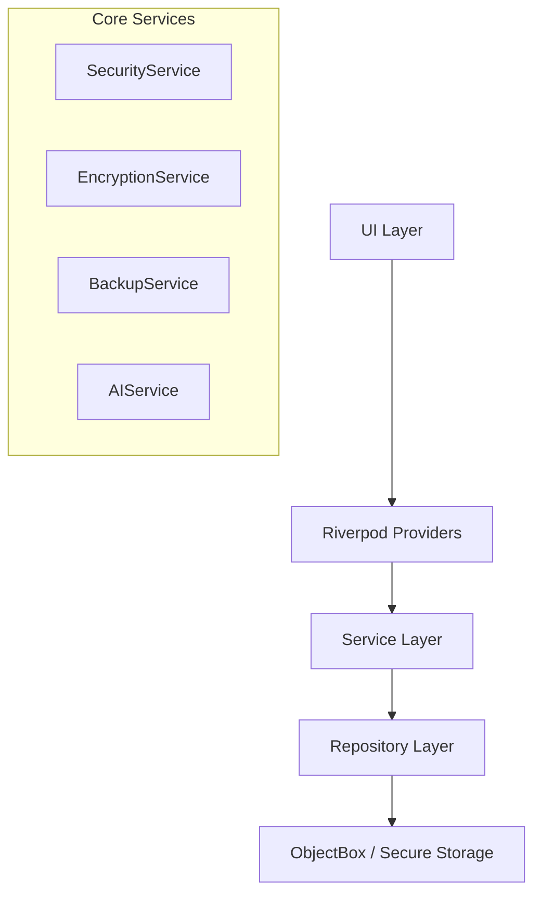

<div align="center">

# 💎 DayVault

**A Quantified Self Journal & Identity Snapshot OS**

[](https://flutter.dev)
[](CHANGELOG.md)
[](LICENSE)
[](#)

---

### 🏛️ Preserve your memories. Track your evolution. Secure your identity.
DayVault is an offline-first, high-security personal journaling platform designed for the aesthetic-conscious "Quantified Self" enthusiast.

[Features](#-key-features) • [Quick Start](#-quick-start) • [Architecture](#-architecture) • [Security](#-security-first) • [Roadmap](#-roadmap)

</div>

---

## 🌟 What is DayVault?

DayVault (internally known as *Memory Palace*) is more than just a diary. It's a structured system for capturing daily reflections ("Stories"), specific moments ("Events"), and your evolving personal preferences ("Identity Snapshots"). 

Built with a stunning **Glassmorphic UI**, it focuses on "Preference Drift"—tracking how your tastes in movies, books, and beliefs change over time, providing a high-fidelity mirror of your self-evolution.

### 📊 Why DayVault?

| Feature | Traditional Apps | DayVault |
|---------|------------------|----------|
| **Privacy** | Cloud-synced (Public) | **Offline-First (Private)** |
| **Security** | Simple Password | **AES-256 + PBKDF2 + Biometrics** |
| **Identity** | Text-only | **Structured Rankings & Drift Tracking** |
| **Aesthetics** | Generic/Material | **Glassmorphism & Ambient Orbs** |
| **AI** | Server-side (OpenAI) | **Local On-Device AI (GGUF/AICore)** |

---

## ✨ Key Features

### 📝 Secure Journaling
- **Dual-Mode Logging**: Choose between **Story Mode** (daily reflections) and **Event Mode** (specific moment capture).
- **Rich Metadata**: Track 14+ emotional states, feelings, and location tags.
- **Auto-Save**: Never lose a thought with 3-second debounced background saving.

### 👤 Identity Snapshots
- **Preference Tracking**: Rank your favorite movies, books, and more to monitor your "Preference Drift."
- **Custom Categories**: Create and manage personal ranking systems with drag-and-drop organization.
- **Drift Badges**: Special badges (🥇🥈🥉) for your top-tier preferences.

### 📅 Calendar Recall
- **Heatmap Indicators**: Visual dots (Indigo for Stories, Emerald for Events) show your journaling density.
- **Infinite History**: Seamless horizontal scrolling through years of memories.
- **Day Detail Sheets**: Quick-peek at entries without leaving the calendar view.

### 🧠 Local AI Assistant
- **On-Device LLM**: Chat with your memories using local GGUF models or Android AICore.
- **Privacy-Preserving**: Your data never leaves your device for AI processing.
- **Smart Search**: Semantic search and insights powered by local embeddings.

### 🔐 Enterprise-Grade Security
- **Multi-Layer Auth**: 4-6 digit PIN with PBKDF2-hardened derivation (100k iterations).
- **Field-Level Encryption**: AES-256-CBC encryption with random IVs for all sensitive data.
- **Biometric Lock**: Instant access via Fingerprint or Face ID.

### 🎨 Premium UI/UX
- **Glassmorphism**: High-sigma backdrop blurs and semi-transparent gradients.
- **Ambient Orbs**: Floating background animations that respond to the app's state.
- **Haptic Design**: Precise tactile feedback for every interaction.

---

## 📸 Screenshots

<div align="center">
  <table style="width:100%">
    <tr>
      <td width="50%"></td>
      <td width="50%"></td>
    </tr>
    <tr>
      <td width="50%"></td>
      <td width="50%"></td>
    </tr>
  </table>
  <p><i>Note: High-quality screenshots coming soon!</i></p>
</div>

---

## 🚀 Quick Start

### Prerequisites
- **Flutter SDK**: `^3.2.0`
- **Dart SDK**: `^3.2.0`
- **Android**: API 26+ (for AICore)
- **iOS**: 12.0+

### Installation

1. **Clone the repository**
   ```bash
   git clone https://github.com/yourusername/dayvault.git
   cd dayvault
   ```

2. **Install dependencies**
   ```bash
   flutter pub get
   ```

3. **Generate code (ObjectBox & Freezed)**
   ```bash
   dart run build_runner build --delete-conflicting-outputs
   ```

4. **Run the app**
   ```bash
   flutter run
   ```

---

## 🏗️ Architecture

DayVault follows a **Layered Service-Repository Pattern** to ensure strict separation of concerns and maximum testability.



### Technical Decisions

| Decision | Implementation | Why? |
|----------|----------------|------|
| **Database** | ObjectBox | NoSQL performance + Offline-first capability. |
| **State Mgmt** | Riverpod 3.x | Compile-time safety + Code generation. |
| **Models** | Freezed | Immutability + Union types + Pattern matching. |
| **Security** | PBKDF2 | Brute-force resistance for PIN derivation. |
| **Encryption** | AES-256-CBC | Industry-standard field-level data protection. |

---

## 🛠️ Tech Stack

### Core
- **Framework**: [Flutter](https://flutter.dev)
- **Language**: [Dart](https://dart.dev)
- **Database**: [ObjectBox](https://objectbox.io)
- **State**: [Riverpod](https://riverpod.dev)

### Key Dependencies
| Package | Purpose |
|---------|---------|
| `flutter_secure_storage` | Platform-native keystore for secrets. |
| `encrypt` | AES-256 cryptographic primitives. |
| `local_auth` | Biometric authentication (FaceID/Fingerprint). |
| `google_fonts` | Typography (Outfit & Libre Baskerville). |
| `image_picker` | Multi-source image capture. |

---

## 📚 Documentation

Detailed guides are available in the `docs/` folder:

- 📖 **[Getting Started](docs/GETTING_STARTED.md)** — Full installation and setup guide.
- ✨ **[Features Catalog](docs/FEATURES.md)** — Deep dive into every DayVault module.
- 🔐 **[Security Protocol](docs/SECURITY_FEATURES.md)** — Detailed breakdown of our encryption layers.
- 🤝 **[Contributing](CONTRIBUTING.md)** — How to help improve DayVault.
- 📜 **[Changelog](CHANGELOG.md)** — Version history and release notes.

---

## 🎯 Roadmap

### 🚧 In Development (v1.2.0)
- [ ] **Rich Text Editor**: Support for bold, italic, and bullet points in entries.
- [ ] **Screenshot Prevention**: Disable screenshots on sensitive screens (Android).
- [ ] **Mood Analytics**: Chart-based visualization of emotional trends over time.

### 📅 Coming Soon
- [ ] **Tags System**: Universal tagging for entries and identity items.
- [ ] **End-to-End Cloud Sync**: Encrypted backup synchronization via WebDAV/Nextcloud.
- [ ] **Panic PIN**: A special code to wipe local data in emergencies.

---

## 🤝 Contributing

Contributions are what make the open-source community such an amazing place to learn, inspire, and create. Any contributions you make are **greatly appreciated**.

1. Fork the Project
2. Create your Feature Branch (`git checkout -b feature/AmazingFeature`)
3. Commit your Changes (`git commit -m 'Add some AmazingFeature'`)
4. Push to the Branch (`git push origin feature/AmazingFeature`)
5. Open a Pull Request

---

## 📜 License

Distributed under the **MIT License**. See `LICENSE` for more information.

---

<div align="center">
  <p>Built with ❤️ for the Quantified Self community.</p>
  <p><b>DayVault — Your memories, vaulted.</b></p>
</div>
